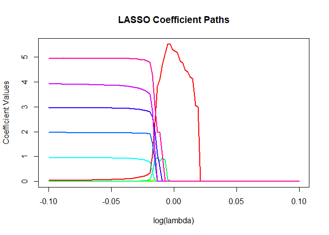

<!-- README.md is generated from README.Rmd. Please edit that file -->

# conquer2

<!-- badges: start -->

[](https://www.gnu.org/licenses/gpl-3.0)
[](https://cran.r-project.org/package=yourPackageName)
<!-- badges: end -->

conquer2 is an edited fork of the package `conquer`. The package
`conquer` is a wonderfully fast package for solving quantile regression
models that enforces the existence of an intercept. This fork of the
package merely removes the intercept and solves no-intercept models. For
any references or information regarding how the package works we refer
you to the original [repository](https://github.com/XiaoouPan/conquer)
and
[manual](https://cran.r-project.org/web/packages/conquer/conquer.pdf)

## Installation

You can install the development version of conquer2 from
[GitHub](https://github.com/) with:

``` r
# install.packages("devtools")
devtools::install_github("alvaromc317/conquer2")
```

## Example 1: unpenalized comparison

This is a basic example which shows you how to solve a common problem:

``` r
set.seed(123)

n = 500
p = 10
p2 = 5

X = matrix(rnorm(n * p, mean=2), ncol = p)
beta = c(rep(0, (p-p2)), 1:p2)
eps = rnorm(n, sd = 0.3)
y = X %*% beta + eps
```

``` r
library(conquer2)
model = conquer(X, y, tau=0.5)
```

``` r
library(quantreg)
#> Loading required package: SparseM
quantreg_model = quantreg::rq(y~-1+X, tau=0.5)
```

| True coef | Conquer coef | Quantreg coef |
|----------:|-------------:|--------------:|
|         0 |         0.00 |          0.00 |
|         0 |        -0.01 |         -0.03 |
|         0 |        -0.02 |         -0.01 |
|         0 |         0.01 |          0.02 |
|         0 |         0.00 |          0.02 |
|         1 |         1.02 |          1.02 |
|         2 |         2.01 |          2.00 |
|         3 |         3.00 |          2.99 |
|         4 |         4.01 |          3.99 |
|         5 |         4.99 |          4.99 |

## Example 2: Penalized quantile regression

The following script solves a range of penalized quantile regression
models with a lasso penalty

``` r
lambda_values <- 10^seq(-0.1, 0.1, length.out=100)
coefficients_matrix <- matrix(0, nrow = length(lambda_values), ncol = ncol(X))

for (i in seq_along(lambda_values))
{
  model <- conquer2::conquer.reg(X, y, penalty = 'lasso', lambda = lambda_values[i], tau = 0.5)
  coefficients_matrix[i, ] <- model$coeff
}

# Plot the coefficient paths
# Use matplot to plot multiple lines (one for each coefficient)
matplot(
  log(lambda_values, base=10),           # Lambda values on log scale
  coefficients_matrix,          # Coefficient matrix
  type = 'l',                   # Line plot
  lty = 1,                      # Line type
  lwd = 2,                      # Line width
  col = rainbow(ncol(X)),       # Different color for each line
  xlab = 'log(lambda)',         # X-axis label
  ylab = 'Coefficient Values',  # Y-axis label
  main = 'LASSO Coefficient Paths'  # Plot title
)
```



## Example 3: Group lasso penalty

``` r
model <- conquer2::conquer.reg(X, y, penalty = 'group', group=1:10, lambda = 0.01, tau = 0.5)
model$coeff
#>  [1]  0.0004451091 -0.0011709595 -0.0009315608  0.0163669788  0.0003702373
#>  [6]  1.0097506152  2.0064185598  2.9960724229  3.9968144220  4.9762831766
```
